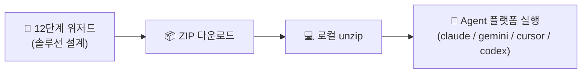
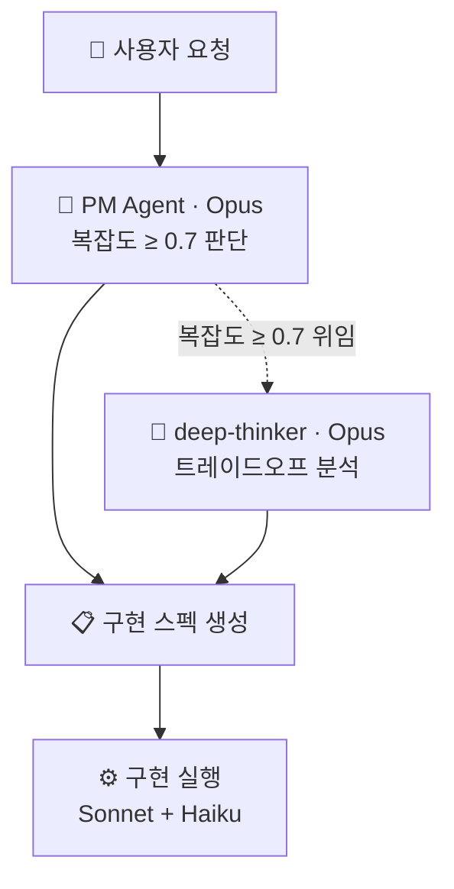
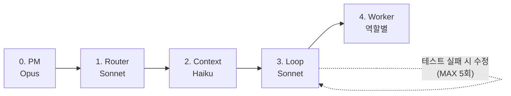
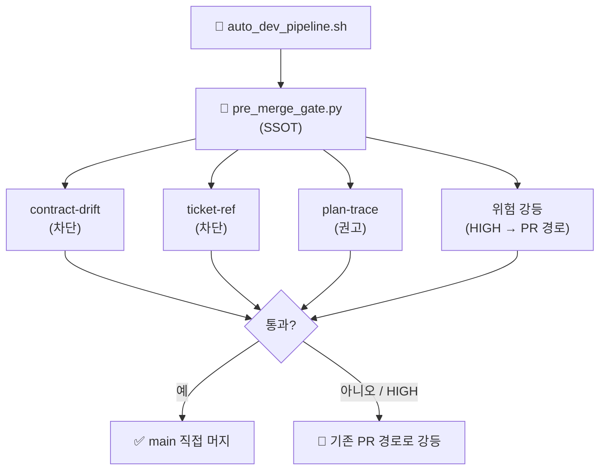
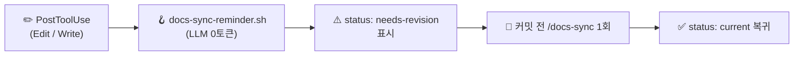

# 🔄 ClickEye 프로세스 맵

ClickEye를 움직이는 핵심 프로세스와 그 정의 문서를 연결한다.

## 1) 제품 플로우 — Web-First

- [[docs/architecture-overview|아키텍처 개요]]
- [[docs/clickeye-product-guide|제품 가이드]]
- [[LoadMap_v3|마스터 로드맵 (2주 스프린트·12단계 위저드)]]

## 2) PM 모델 라우팅 파이프라인
Opus는 계획/설계, Sonnet은 구현 — 토큰 비용 최적화.

- [[.claude/agents/pm-agent|pm-agent]]
- [[.claude/agents/deep-thinker|deep-thinker]]
- [[.claude/MODEL-ROUTING|모델 라우팅 가이드]]

## 3) 하네스 엔지니어링 (5단계)
AI 코드 작성을 통제해 환각/오류 사전 차단.

- [[.claude/agents/harness-guide|하네스 전체 흐름 가이드]]
- 스킬: harness-router · harness-context · harness-loop · harness-worker

## 4) 거버넌스 게이트 (자동 머지)
자율 파이프라인이 main 직접 머지 직전 단일 SSOT로 검증+위험분류.

- [[docs/pipeline-guide|파이프라인 가이드 (Step 5.5)]]
- `scripts/pre_merge_gate.py` (SSOT)

## 5) 자동화 개발 파이프라인 (Flow-Ops)

- [[docs/clickeye-development-pipeline|개발 파이프라인]]
- [[docs/pipeline-guide|파이프라인 가이드 (v6 — 메타프롬프트 + 거버넌스)]]

## 6) 문서 지속 현행화

- [[docs/README|문서 매니페스트 (SSoT 레지스트리)]]
- [[📊 문서현황|문서 현황 대시보드]]

[[🏠 ClickEye Home|← Home]]
